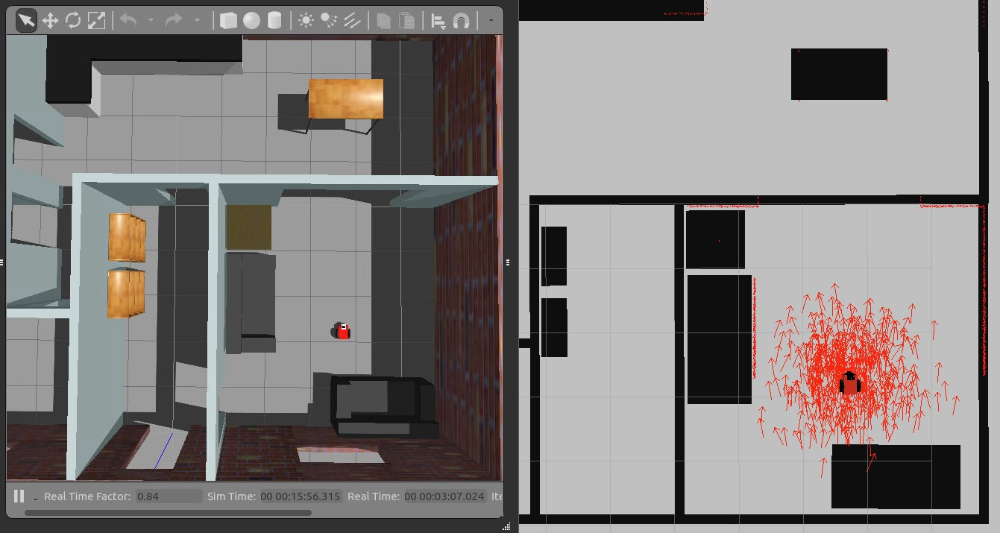
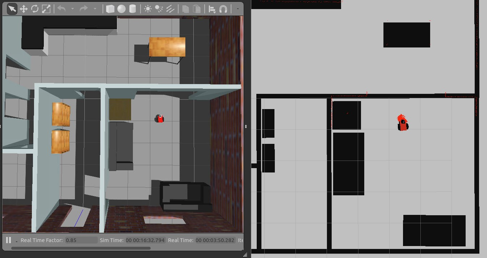

## Description

A demonstration of the Adaptive Monte Carlo Localization (AMCL) algorithm performing robot localization within a pre-mapped environment. A simple two-wheeled robot uses a Hokuyo laser range finder to detect its surroundings, and compares this to a 'ground-truth' map to localize it's position. The robot is built using the ROS framework and simulated using the Gazebo simulator.

## Setup Repo
#### Clone repo into catkin workspace:
```
$ git clone git@github.com:GZHOUW/WhereAmI
Place the repo in workspace/catkin_ws/src

$ cd workspace/catkin_ws/
$ catkin_make
```
#### Initialise the robot and environment:
```
$ cd workspace/catkin_ws/
$ source devel/setup.bash
$ roslaunch my_robot world.launch
```
This will start an instance of Gazebo containing the robot housed within a building interior, and an instance of RViz containing the ground-truth map.

#### Switch on the AMCL localisation algorithm:
In a second terminal, run:
```
$ cd ~/catkin_ws/
$ source devel/setup.bash
$ roslaunch my_robot amcl.launch
```
Within RViz, a red particle cloud will appear (showing all positions where the AMCL algorithm thinks the robot may be), and the robot will be shown in the 'best guess' position.

#### Control the robot:
In a third terminal, run:
```
$ cd ~/catkin_ws/
$ source devel/setup.bash
$ rosrun teleop_twist_keyboard teleop_twist_keyboard.py
```
With this terminal highlighted, the robot can now be driven within Gazebo (see prompts for key bindings). As the robot moves, the particle swarm shown in RViz will update to track the robot position, which should converge over a number of steps to narrow down and track the true position.

## Demo:
1. Initializing


2. Converged

